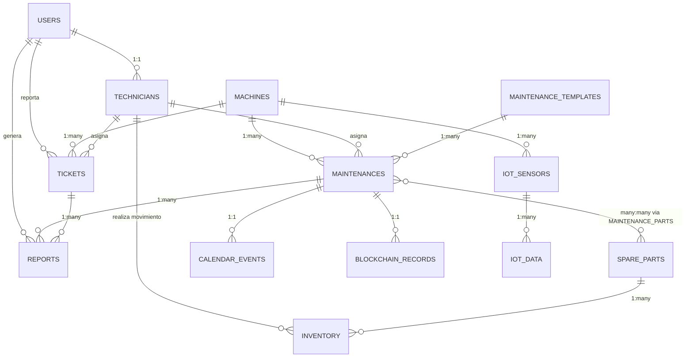

# Diseño de Arquitectura: Sistema de Gestión de Mantenimiento para Máquinas Bancarias

## Introducción
Este documento detalla la arquitectura del Sistema de Gestión de Mantenimiento (SGM) para máquinas bancarias. El sistema debe ser escalable, seguro, con soporte para acceso móvil y preparado para integraciones avanzadas como IoT y blockchain. La arquitectura se basa en una pila tecnológica moderna que prioriza la seguridad, la mantenibilidad y la escalabilidad.

## Pila Tecnológica

### Frontend
- **Framework Principal**: React.js para una interfaz de usuario responsiva y modular.
- **Acceso Móvil**: React Native para aplicaciones nativas móviles, permitiendo a los técnicos acceder al sistema desde dispositivos móviles. Alternativamente, una Progressive Web App (PWA) para compatibilidad multiplataforma sin desarrollo nativo.
- **Estado y Gestión de Datos**: Redux o Context API para manejo de estado global; Axios para llamadas a APIs.
- **UI/UX**: Material-UI o Ant Design para componentes reutilizables y diseño consistente.
- **Herramientas Adicionales**: TypeScript para tipado estático, ESLint para linting, y Webpack para bundling.

### Backend
- **Framework Principal**: Node.js con Express.js para APIs RESTful ligeras y eficientes.
- **Arquitectura**: Microservicios para modularidad y escalabilidad, con servicios separados para autenticación, gestión de mantenimientos, reportes y integraciones.
- **Lenguaje**: JavaScript/TypeScript para consistencia con el frontend.
- **Herramientas Adicionales**: Swagger para documentación de APIs, PM2 para gestión de procesos en producción.

### Base de Datos
- **Sistema Principal**: PostgreSQL para datos relacionales complejos, incluyendo esquemas para máquinas, mantenimientos, usuarios y logs.
- **Almacenamiento No Relacional**: MongoDB para datos no estructurados como logs de IoT o metadatos de blockchain.
- **ORM**: Sequelize o TypeORM para abstracción de base de datos y migraciones seguras.
- **Caché**: Redis para sesiones y datos frecuentemente accedidos, mejorando el rendimiento.

## Esquema de Base de Datos

### Entidades Principales
El esquema de base de datos se basa en las siguientes entidades principales:
- **Usuarios**: Gestión de usuarios con roles (administrador, técnico, usuario).
- **Máquinas**: Información de las máquinas bancarias.
- **Técnicos**: Especialización y disponibilidad de técnicos.
- **Repuestos**: Catálogo de repuestos con inventario.
- **Plantillas de Mantenimiento**: Definiciones para mantenimientos preventivos y correctivos.
- **Mantenimientos**: Registros de trabajos de mantenimiento realizados.
- **Tickets**: Sistema de tickets para reportes y seguimiento de issues.
- **Calendario**: Eventos programados para mantenimientos.
- **Reportes**: Generación de reportes de mantenimientos y tickets.
- **Sensores IoT**: Configuración de sensores en máquinas.
- **Datos IoT**: Recolección de datos de sensores.
- **Registros Blockchain**: Trazabilidad inmutable de mantenimientos.

### Tablas y Columnas

#### Usuarios (users)
- `id`: SERIAL PRIMARY KEY
- `username`: VARCHAR(50) UNIQUE NOT NULL
- `email`: VARCHAR(100) UNIQUE NOT NULL
- `password_hash`: VARCHAR(255) NOT NULL
- `role`: VARCHAR(20) NOT NULL (admin, tecnico, usuario)
- `created_at`: TIMESTAMP DEFAULT NOW()
- `updated_at`: TIMESTAMP DEFAULT NOW()

#### Máquinas (machines)
- `id`: SERIAL PRIMARY KEY
- `name`: VARCHAR(100) NOT NULL
- `model`: VARCHAR(100)
- `serial_number`: VARCHAR(100) UNIQUE NOT NULL
- `location`: VARCHAR(200)
- `installation_date`: DATE
- `status`: VARCHAR(20) DEFAULT 'active'
- `created_at`: TIMESTAMP DEFAULT NOW()
- `updated_at`: TIMESTAMP DEFAULT NOW()

#### Técnicos (technicians)
- `id`: SERIAL PRIMARY KEY
- `user_id`: INTEGER REFERENCES users(id) ON DELETE CASCADE
- `specialization`: VARCHAR(100)
- `availability`: BOOLEAN DEFAULT TRUE

#### Repuestos (spare_parts)
- `id`: SERIAL PRIMARY KEY
- `name`: VARCHAR(100) NOT NULL
- `description`: TEXT
- `part_number`: VARCHAR(100) UNIQUE NOT NULL
- `category`: VARCHAR(50)
- `unit_cost`: DECIMAL(10,2)
- `quantity_in_stock`: INTEGER DEFAULT 0
- `minimum_stock`: INTEGER DEFAULT 0
- `supplier`: VARCHAR(100)
- `created_at`: TIMESTAMP DEFAULT NOW()

#### Inventario (inventory)
- `id`: SERIAL PRIMARY KEY
- `spare_part_id`: INTEGER REFERENCES spare_parts(id) ON DELETE CASCADE
- `quantity`: INTEGER NOT NULL
- `movement_type`: VARCHAR(20) NOT NULL (in, out, adjustment)
- `reason`: TEXT
- `technician_id`: INTEGER REFERENCES technicians(id)
- `date`: TIMESTAMP DEFAULT NOW()

#### Plantillas de Mantenimiento (maintenance_templates)
- `id`: SERIAL PRIMARY KEY
- `name`: VARCHAR(100) NOT NULL
- `description`: TEXT
- `type`: VARCHAR(20) NOT NULL (preventive, corrective)
- `frequency_days`: INTEGER
- `estimated_duration_hours`: DECIMAL(5,2)
- `required_parts`: JSONB
- `instructions`: TEXT
- `created_at`: TIMESTAMP DEFAULT NOW()

#### Mantenimientos (maintenances)
- `id`: SERIAL PRIMARY KEY
- `machine_id`: INTEGER REFERENCES machines(id) ON DELETE CASCADE
- `template_id`: INTEGER REFERENCES maintenance_templates(id)
- `technician_id`: INTEGER REFERENCES technicians(id)
- `type`: VARCHAR(20) NOT NULL
- `scheduled_date`: DATE
- `actual_date`: DATE
- `status`: VARCHAR(20) DEFAULT 'scheduled'
- `priority`: VARCHAR(20) DEFAULT 'medium'
- `description`: TEXT
- `notes`: TEXT
- `duration_hours`: DECIMAL(5,2)
- `cost`: DECIMAL(10,2)
- `created_at`: TIMESTAMP DEFAULT NOW()
- `updated_at`: TIMESTAMP DEFAULT NOW()

#### Tickets (tickets)
- `id`: SERIAL PRIMARY KEY
- `machine_id`: INTEGER REFERENCES machines(id) ON DELETE CASCADE
- `reported_by`: INTEGER REFERENCES users(id)
- `assigned_to`: INTEGER REFERENCES technicians(id)
- `title`: VARCHAR(200) NOT NULL
- `description`: TEXT
- `priority`: VARCHAR(20) DEFAULT 'medium'
- `status`: VARCHAR(20) DEFAULT 'open'
- `created_at`: TIMESTAMP DEFAULT NOW()
- `updated_at`: TIMESTAMP DEFAULT NOW()
- `resolved_at`: TIMESTAMP

#### Calendario (calendar_events)
- `id`: SERIAL PRIMARY KEY
- `maintenance_id`: INTEGER REFERENCES maintenances(id) ON DELETE CASCADE
- `title`: VARCHAR(200) NOT NULL
- `start_date`: TIMESTAMP NOT NULL
- `end_date`: TIMESTAMP
- `description`: TEXT
- `reminder`: BOOLEAN DEFAULT FALSE

#### Reportes (reports)
- `id`: SERIAL PRIMARY KEY
- `maintenance_id`: INTEGER REFERENCES maintenances(id)
- `ticket_id`: INTEGER REFERENCES tickets(id)
- `generated_by`: INTEGER REFERENCES users(id)
- `type`: VARCHAR(50) NOT NULL
- `content`: JSONB
- `generated_at`: TIMESTAMP DEFAULT NOW()

#### Sensores IoT (iot_sensors)
- `id`: SERIAL PRIMARY KEY
- `machine_id`: INTEGER REFERENCES machines(id) ON DELETE CASCADE
- `sensor_type`: VARCHAR(50) NOT NULL
- `sensor_id`: VARCHAR(100) UNIQUE NOT NULL
- `location_on_machine`: VARCHAR(100)
- `status`: VARCHAR(20) DEFAULT 'active'

#### Datos IoT (iot_data)
- `id`: SERIAL PRIMARY KEY
- `sensor_id`: INTEGER REFERENCES iot_sensors(id) ON DELETE CASCADE
- `value`: DECIMAL(10,4)
- `unit`: VARCHAR(20)
- `timestamp`: TIMESTAMP DEFAULT NOW()

#### Registros Blockchain (blockchain_records)
- `id`: SERIAL PRIMARY KEY
- `maintenance_id`: INTEGER REFERENCES maintenances(id)
- `transaction_hash`: VARCHAR(255) UNIQUE NOT NULL
- `block_number`: BIGINT
- `timestamp`: TIMESTAMP DEFAULT NOW()
- `data_hash`: VARCHAR(255)

#### Partes en Mantenimiento (maintenance_parts) - Tabla Intermedia
- `id`: SERIAL PRIMARY KEY
- `maintenance_id`: INTEGER REFERENCES maintenances(id)
- `spare_part_id`: INTEGER REFERENCES spare_parts(id)
- `quantity_used`: INTEGER NOT NULL
- `cost`: DECIMAL(10,2)

### Relaciones
- **Uno a Uno**: Usuarios -> Técnicos, Mantenimientos -> Calendario, Mantenimientos -> Blockchain Records
- **Uno a Muchos**: Máquinas -> Mantenimientos, Máquinas -> Tickets, Máquinas -> Sensores IoT, Técnicos -> Mantenimientos, Técnicos -> Tickets, Técnicos -> Inventario, Repuestos -> Inventario, Plantillas -> Mantenimientos, Mantenimientos -> Reportes, Tickets -> Reportes, Sensores -> Datos IoT
- **Muchos a Muchos**: Mantenimientos <-> Repuestos (vía maintenance_parts)

### Índices para Optimización
- Índices en todas las claves foráneas (e.g., INDEX on maintenances(machine_id))
- Índices en campos de consulta frecuente: maintenances(status), maintenances(scheduled_date), tickets(status), iot_data(timestamp)
- Índices compuestos: (machine_id, status) en maintenances, (sensor_id, timestamp) en iot_data

### Consideraciones de Integridad Referencial y Normalización
- **Integridad Referencial**: Claves foráneas con ON DELETE CASCADE para dependencias críticas (e.g., eliminar máquina elimina mantenimientos). Usar SET NULL para opcionales.
- **Normalización**: Esquema en 3NF para minimizar redundancia. Datos atómicos, dependencias funcionales correctas.
- **Constraints**: CHECK constraints en campos enumerados (e.g., role IN ('admin', 'tecnico', 'usuario')). UNIQUE en campos únicos.
- **Triggers**: Para actualizar timestamps (updated_at), calcular costos automáticos en mantenimientos.
- **Auditoría**: Logs de cambios en tablas críticas usando triggers.

### Diagrama de Entidad-Relación


### Autenticación y Seguridad
- **Autenticación**: JWT (JSON Web Tokens) para sesiones stateless; OAuth 2.0 para integración con proveedores externos (e.g., Google, Microsoft).
- **Autorización**: Role-Based Access Control (RBAC) con roles como Administrador, Técnico y Usuario.
- **Seguridad de Datos**: Encriptación AES-256 para datos sensibles; HTTPS obligatorio con certificados SSL/TLS.
- **Protecciones Adicionales**: Rate limiting, CORS, Helmet para headers seguros, y auditorías de logs con herramientas como Winston.
- **Cumplimiento**: Adherencia a estándares bancarios como PCI DSS, con encriptación de extremo a extremo para transmisiones de datos.

## Estructura de Directorios

### Estructura General del Proyecto
```
sgm-bancario/
├── frontend/
│   ├── public/
│   ├── src/
│   │   ├── components/
│   │   ├── pages/
│   │   ├── services/
│   │   ├── utils/
│   │   └── App.js
│   ├── package.json
│   └── Dockerfile
├── backend/
│   ├── src/
│   │   ├── controllers/
│   │   ├── models/
│   │   ├── routes/
│   │   ├── middleware/
│   │   ├── services/
│   │   └── app.js
│   ├── config/
│   ├── tests/
│   ├── package.json
│   └── Dockerfile
├── database/
│   ├── migrations/
│   ├── seeds/
│   └── scripts/
├── docs/
├── docker-compose.yml
├── .env.example
└── README.md
```

- **Frontend**: Estructura típica de React con separación de componentes, páginas y servicios.
- **Backend**: Arquitectura limpia con separación de responsabilidades (MVC-like).
- **Database**: Scripts de migración y seeds para PostgreSQL.
- **Docs**: Documentación adicional, incluyendo APIs y guías de despliegue.

## Integraciones Avanzadas

### IoT
- **Protocolos**: MQTT para comunicación en tiempo real con sensores en máquinas bancarias (e.g., temperatura, vibraciones).
- **Plataforma**: Integración con AWS IoT o Azure IoT Hub para recolección y procesamiento de datos.
- **Procesamiento**: Servicios backend para análisis predictivo de mantenimientos basados en datos IoT.

### Blockchain
- **Plataforma**: Ethereum o Hyperledger para trazabilidad inmutable de mantenimientos y transacciones.
- **Smart Contracts**: Para automatización de contratos de mantenimiento y verificación de cumplimiento.
- **Integración**: APIs REST para interactuar con nodos blockchain, almacenando hashes de registros en la base de datos principal.

## Consideraciones para Despliegue y Escalabilidad

### Despliegue
- **Contenedorización**: Docker para empaquetar frontend, backend y base de datos en contenedores independientes.
- **Orquestación**: Kubernetes para gestión de contenedores en entornos de producción, con autoescalado horizontal.
- **Cloud Providers**: AWS (ECS/EKS), Azure (AKS) o GCP para infraestructura como servicio, con balanceadores de carga y CDNs.
- **CI/CD**: GitHub Actions o Jenkins para pipelines automatizados de build, test y despliegue.

### Escalabilidad
- **Arquitectura**: Microservicios permiten escalar servicios individuales (e.g., más instancias de backend durante picos de uso).
- **Base de Datos**: Sharding y réplicas de lectura en PostgreSQL para manejar altos volúmenes de datos.
- **Rendimiento**: Implementación de caché distribuido (Redis Cluster) y optimización de queries.
- **Monitoreo**: Prometheus y Grafana para métricas en tiempo real; ELK Stack (Elasticsearch, Logstash, Kibana) para logs y alertas.
- **Resiliencia**: Circuit breakers, retries y failover automático para alta disponibilidad.

Esta arquitectura proporciona una base sólida para un sistema seguro, escalable y preparado para el futuro, alineado con las necesidades de un entorno bancario crítico.